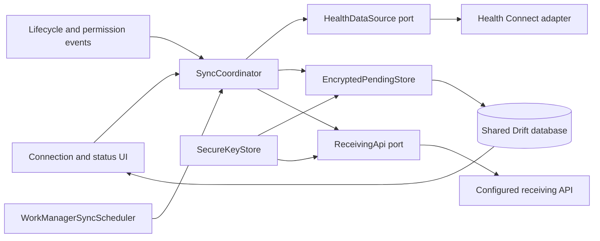

# Implementation Plan: Add Health Connect Sync

**Branch**: `001-add-health-connect-sync` | **Date**: 2026-09-24 | **Spec**: [spec.md](spec.md)

**Input**: Feature specification from `specs/001-add-health-connect-sync/spec.md`

## Summary

Build an Android-first Flutter application that obtains explicit read-only access to Android Health Connect, automatically checks for new activity, vital, sleep, and body records, and submits normalized records to a configured receiving API. The first release treats Health Connect as the source of truth and includes Samsung Health-origin records when Health Connect exposes them. It does not require a direct Samsung partner integration.

The implementation uses a platform-neutral domain boundary (`HealthDataSource`) with a `health` adapter, a `workmanager` scheduler, a shared Drift database for unsent work, AES-GCM encryption for sensitive pending payloads, secure storage for the installation credential and encryption key, and Dio for idempotent API delivery. The receiving and sending states are persisted independently so the UI remains truthful when the app is inactive or a transfer fails.

Health Connect does not provide a general push notification for ordinary apps. “Automatic” therefore means an immediate one-off run after permission/resume events plus a unique 15-minute WorkManager polling task using change cursors. The app never claims immediate execution or successful delivery when Android defers or blocks work.

## Technical Context

**Language/Version**: Dart 3.11.4 / Flutter 3.41.6 stable; Kotlin 2.1.x and Java 21 for the Android host; Android Gradle Plugin compatible with the pinned Flutter toolchain.

**Primary Dependencies**:

- `health: ^13.3.2` — mature Health Connect/HealthKit adapter with availability checks, granular permissions, range reads, and direct change-token/upsert/delete APIs.
- `workmanager: ^0.10.10` — Android WorkManager and future iOS background scheduling behind one Dart callback boundary.
- `flutter_riverpod: >=3.3.2 <3.4.0` — dependency injection and reactive status/UI state without coupling widgets to platform plugins. The upper bound keeps the package compatible with Dart 3.11.4.
- `dio: ^5.11.1` — bounded HTTP timeouts, cancellation, interceptors, and testable transport adapters.
- `drift: >=2.34.0 <2.35.0` and `drift_flutter: ^0.3.1` — typed reactive persistence with a database isolate shared by the UI and WorkManager callback. The range is selected for the pinned Flutter/Dart meta package.
- `flutter_secure_storage: ^11.2.0` — installation credential and database encryption key storage.
- `cryptography: ^2.9.0` and `cryptography_flutter: ^2.3.4` — authenticated AES-GCM encryption for pending health payloads.
- Health Connect's `health` adapter handles the platform permission and settings surfaces; no generic runtime-permission plugin is required.
- `url_launcher: ^6.3.2` — open Health Connect settings, Play Store installation/update, and privacy/support surfaces.
- `path_provider: ^2.1.6` — application database location.
- Development: `drift_dev >=2.34.0 <2.35.0`, `build_runner >=2.15.1 <2.16.0`, `flutter_lints: ^6.0.0`, `mocktail`, and Flutter's `integration_test` package. These ranges are the newest solver-compatible set for Dart 3.11.4.

**Storage**: Drift/SQLite in the application support directory, opened with `shareAcrossIsolates: true`. Only encrypted pending health payloads, encrypted cursors, operation metadata, counts, and sanitized errors are persisted. Acknowledged payloads are deleted; the installation credential and AES key are held only in secure storage.

**Testing**: `flutter test` for domain/widget/contract tests, `flutter analyze`, `dart format --set-exit-if-changed`, and Android device/integration tests using the Health Connect Toolbox/test provider. A physical Samsung device is required for source-origin and OEM background-execution validation when available.

**Target Platform**: Android API 28+ for the first release, compiled/targeted against API 36 with the selected `health` release's SDK-extension requirements. Health Connect is a framework service on Android 14+ and an APK on Android 13 and lower. iOS 15+ is a future adapter target, not a v1 delivery platform.

**Project Type**: Flutter mobile application with a feature-first presentation/domain/data structure, an Android background worker, and an external receiving API.

**Performance Goals**:

- Use a unique periodic WorkManager task at the platform minimum of 15 minutes, with an immediate one-off task on permission grant, app resume, and recoverable connectivity changes.
- Establish per-record-type cursors after the first authorized 30-day backfill; subsequent runs process only new/upserted/deleted changes.
- Use Health Connect pagination with a page size of 1,000 and API batches of at most 100 operations; handle 1,000 mixed records in the validation set without silent loss.
- Keep the UI responsive while reads, encryption, persistence, and network work run outside the widget build path.
- Reflect a service acknowledgement in the persisted sent state within 30 seconds when the app process is available.

**Constraints**:

- Health Connect is read-only in v1; no Health Connect write permissions or writes to source records.
- Background reads require a separate platform permission and may be delayed by OS/OEM policy; WorkManager is not an exact alarm.
- Health Connect change tokens can expire; recovery uses a bounded re-read and stable-identity deduplication.
- Health values must not appear in logs, status text, analytics, crash reports, URLs, or committed fixtures.
- The installation credential is deployment-provided, stored securely, and never committed. A mobile binary cannot be treated as a permanent secret vault.
- The API base URL, path, schema version, and credential are deployment configuration; the client contract is versioned and isolated from domain code.
- Direct Samsung Health Data SDK access is not required in v1 because production distribution requires a separate partner approval and would create a second consent/source system.

**Scale/Scope**:

- Four categories: activity, vitals, sleep, and body measurements.
- Initial backfill: most recent 30 calendar days; later runs: new or changed records.
- Validation volume: 1,000 eligible records across all categories, including pagination, corrections, deletions, and partial failures.
- One configured receiving service and one installation credential for the first release; no user account or historical dashboard.

**Unresolved Technical Decisions**: None. Deployment-specific API values are configuration inputs, and all product clarifications are resolved in `spec.md`.

## Constitution Check

*GATE: Must pass before Phase 0 research. Re-check after Phase 1 design.*

| Principle / constraint | Evidence in this plan | Result |
|-----------------------|------------------------|--------|
| Specification before implementation | `spec.md` is the source of truth and this plan records technical decisions separately. | PASS |
| Small, testable increments | The design keeps permission/UI, source adapter, queue/crypto, scheduler, and API delivery independently testable. | PASS |
| Flutter and Dart quality | The plan uses the installed stable toolchain, pinned packages, formatting, analyzer, and generated-code checks. | PASS |
| Tests protect behavior | Unit, widget, contract, and Android device/integration layers are specified. | PASS |
| Accessible, responsive UX | Status states, semantics, small-screen behavior, and loading/empty/error/success states are explicit. | PASS |
| Feature artifacts and secret hygiene | All design artifacts live under the feature directory; credentials and health values are excluded from source/logs. | PASS |

**Gate result: PASS.** Research and Phase 1 design may proceed.

## Project Structure

### Documentation (this feature)

```text
specs/001-add-health-connect-sync/
├── plan.md              # This implementation plan
├── research.md          # Phase 0 technical decisions and sources
├── data-model.md        # Phase 1 entities, state transitions, and validation
├── quickstart.md        # Device and contract validation runbook
├── contracts/
│   ├── README.md
│   ├── health-data-source.md
│   ├── health-records-api.md
│   └── sync-status.md
├── spec.md
└── checklists/
    └── requirements.md
```

`tasks.md` is intentionally not created by `/speckit.plan`; it is generated by `/speckit.tasks` after this plan is reviewed.

### Source Code (repository root)

The implementation will bootstrap a single Flutter app. The tree below is the target layout; paths are created as their implementation slices are introduced.

```text
lib/
├── main.dart
├── app/
│   ├── app.dart
│   ├── dependencies.dart
│   ├── lifecycle/
│   └── routing.dart
├── core/
│   ├── config/
│   ├── errors/
│   ├── logging/
│   ├── platform/
│   └── time/
├── features/
│   ├── connection/
│   │   ├── data/
│   │   ├── domain/
│   │   └── presentation/
│   ├── sync/
│   │   ├── data/
│   │   ├── domain/
│   │   └── presentation/
│   └── status/
│       ├── domain/
│       └── presentation/
├── data/
│   ├── health/
│   │   ├── health_data_source.dart
│   │   ├── health_connect_data_source.dart
│   │   └── record_mapper.dart
│   ├── persistence/
│   │   ├── app_database.dart
│   │   ├── encrypted_pending_store.dart
│   │   └── secure_key_store.dart
│   ├── api/
│   │   ├── receiving_api.dart
│   │   ├── dio_receiving_api.dart
│   │   └── api_mapper.dart
│   └── credentials/
│       └── installation_credential_store.dart
├── background/
│   ├── background_entrypoint.dart
│   ├── sync_scheduler.dart
│   └── workmanager_sync_scheduler.dart
└── shared/
    ├── widgets/
    └── formatters/

android/
├── app/
│   ├── build.gradle.kts
│   └── src/main/
│       ├── AndroidManifest.xml
│       └── kotlin/com/example/flutter_stats/MainActivity.kt

ios/                         # Reserved for a later HealthKit adapter; not v1 scope
test/
├── unit/
├── widget/
├── contract/
└── support/

integration_test/
└── health_sync_e2e_test.dart
```

**Structure Decision**: Use one Flutter application with feature-first presentation/domain/data packages. Platform APIs are accessed only through `HealthDataSource`, `SyncScheduler`, and `ReceivingApi` ports. WorkManager and Health Connect are configured in the Android runner/manifest, while the domain and API contracts remain reusable for a future iOS adapter. No separate backend repository is created; the receiving API is an external dependency.

## Architecture



### Domain ports

- **`HealthDataSource`**: checks availability, manages read permissions, reads the initial 30-day window, reads incremental changes, and maps platform errors. It exposes canonical records and opaque cursors, never plugin-specific record classes.
- **`SyncScheduler`**: starts/stops the unique periodic task and requests one-off runs for permission/resume/connectivity events.
- **`ReceivingApi`**: submits versioned upsert/delete batches and returns a safe acknowledgement or a classified error.
- **`PendingStore`**: atomically stores encrypted pending operations, cursors, identity indexes, status metadata, and retry metadata.
- **`CredentialStore`**: reads/writes the installation credential without exposing it to the UI or logs.

### `SyncCoordinator`

The coordinator is a pure domain/application service with injected ports. It is used by both the foreground app and the background entrypoint. It enforces this order:

1. Load connection and cursor state.
2. Check service availability, current permissions, background-read eligibility, and credential state.
3. Claim a unique sync run so foreground and background triggers cannot overlap.
4. For a first run, establish a cursor and read the bounded 30-day window. For later runs, consume each per-type change page.
5. Normalize records, preserve source/origin, and coalesce changes by identity/version.
6. Encrypt and persist upsert/delete operations before advancing the corresponding cursor.
7. Select due operations in bounded batches, claim each with a short database lease, and submit them through `ReceivingApi`.
8. Mark only acknowledged operations as sent and delete their encrypted payloads.
9. Persist retry/blocked/empty state and the receiving/sending status snapshot.
10. Close the run or schedule the next permitted retry.

### Health Connect adapter

The Android adapter uses `health` for:

- SDK/platform availability and background-feature checks.
- Read-permission status and request results.
- Initial time-range reads.
- `getChangesToken()` and `getChanges()` calls with per-type cursors, upserted data points, deleted IDs, pagination, and token-expiry status.
- Runtime error mapping (`permission`, `unavailable`, `rate_limited`, `cursor_expired`, `temporarily_unavailable`, and `invalid_data`).

The adapter declares only the read permissions required by the selected record catalog. It does not expose write methods. Samsung Health records are accepted when their source metadata identifies Samsung Health; no direct Samsung credentials or APIs are used.

### Background execution

`workmanager` registers a top-level callback that initializes the same dependency graph used by the app. It uses:

- One unique periodic task with a 15-minute frequency, network constraint, and keep-existing policy.
- One unique immediate task name for permission/resume/connectivity triggers.
- Exponential backoff for retryable failures.
- Persisted run/operation state so an isolate restart does not lose the receiving/sending distinction.

The periodic task is a polling mechanism, not a promise of exact timing. The UI shows `waiting`/`paused` when Android defers execution. A foreground resume can enqueue an immediate task, but the normal path does not require the user to press a sync button.

Before release, run a background-isolate smoke test on API 28, API 33, and API 34+ and verify that the `health` plugin initializes and maps permission/IPC failures safely inside the WorkManager callback. If that gate fails, replace only the Android source/scheduler adapters with a native Kotlin `CoroutineWorker` behind the same ports; do not fork the domain, persistence, or API layers.

### Local persistence and encryption

Drift uses a shared database isolate so the WorkManager callback and UI can coordinate safely. The database contains:

- `sync_cursors` keyed by platform and record type.
- `record_identity_index` for deletion and recovery.
- `pending_operations` with encrypted, versioned payloads, safe state metadata, and worker leases.
- `sync_runs` with independent receiving/sending state and counts.
- `connection_state` with availability, permission, background, and credential state.

Health payloads are serialized canonically and encrypted using AES-GCM before persistence. The key and installation credential are stored with `flutter_secure_storage`; Android backup is disabled or excludes the secure-storage files. No complete acknowledged history is retained.

### Receiving API

Dio is configured from `ApiConfiguration` with HTTPS, timeouts, a redacting interceptor, and an installation-credential provider. Operations are idempotent and batched at 100 items. The default contract is documented in [`contracts/health-records-api.md`](contracts/health-records-api.md); the adapter can translate field names or paths without changing domain models.

Retry classification:

- Retry: connection errors, timeouts, 408, 425, 429, and 5xx. A timeout after dispatch is ambiguous, so the operation remains pending and reuses its idempotency key.
- Block: 400 validation, 401/403 authorization/credential failures, malformed contract responses, and unknown permanent failures.
- Backoff is bounded and preserves the original operation/idempotency key; the server must reconcile repeated keys.

### UI and accessibility

The first screen provides:

- Permission rationale and category availability.
- Connect/retry/settings/disconnect actions.
- Independent receiving and sending status indicators.
- Per-category counts and source labels, without health values.
- Empty, blocked, paused, retrying, failed, and last-success states.
- Small-screen layouts, semantics, readable contrast, and text labels that do not rely on color.

`contracts/sync-status.md` is the state/UI contract. Riverpod providers expose snapshots to presentation code; platform plugins are not accessed directly by widgets.

## Synchronization and Recovery Rules

1. **Initial authorization:** after required read and background permissions are granted, schedule an immediate run and establish a cursor for each supported record type before the initial backfill, so changes arriving during the backfill are picked up next time.
2. **Initial history:** read the most recent 30 calendar days. Persist records and cursor state transactionally; repeat reads are safe because identity/version deduplication is idempotent.
3. **Incremental changes:** consume all pages for a cursor, persist each page's operations, and only then advance the durable cursor.
4. **Corrections:** an upsert with a newer source version replaces the unsent representation of the same identity or produces an update operation; it is not a second identity.
5. **Deletions:** use the per-type cursor and identity index to send a delete for the same identity. If a deletion cannot be mapped, surface a safe data error.
6. **Cursor expiry:** re-read the bounded recovery window, reconcile against the identity index, discard stale versions, and establish a new cursor.
7. **Partial permissions:** continue with granted types, mark blocked types, and never send data for a type without current permission.
8. **Network/API failure:** keep encrypted operations pending, retain the same idempotency key, and retry without requiring a new permission grant.
9. **Credential failure:** block sending, show a deployment/configuration state, retain pending data, and never display the credential.
10. **Disconnect:** cancel/stop scheduled work, prevent new reads/transfers, and remove unsent local payloads.
11. **Duplicate work:** unique periodic and one-off work names plus a database run claim prevent concurrent processing.
12. **Rate limits:** use change tokens, bounded pages, 100-item API batches, and backoff rather than repeatedly reading the full history.
13. **Worker recovery:** reclaim expired operation leases on the next run; a process death must not strand an operation in `sending`.

## Security and Privacy Plan

- Request and explain granular read access; do not request write access.
- Provide the Health Connect privacy-policy/rationale surface and align it with the Play Console declaration.
- Use TLS for the receiving API and reject insecure production endpoints.
- Store the installation credential and encryption key in secure storage; never commit them or include them in build logs.
- Encrypt pending health payloads with AES-GCM; keep status/diagnostic fields value-free.
- Redact Dio and SDK logs; prohibit request/response body logging in release builds.
- Delete acknowledged payloads and all unsent payloads on explicit disconnect.
- Test Android backup behavior and secure-storage restoration before release.
- Treat a mobile installation credential as provisionable/short-lived; a long-lived shared secret requires a separate security review.

## Testing Strategy

| Layer | Target | Required cases |
|-------|--------|-----------------|
| Pure Dart unit | Domain and application services | Record mapping, identity/version deduplication, cursor expiry recovery, state transitions, retry classification, encryption, and retention. |
| Database | Drift and crypto store | Atomic queue/cursor updates, cross-isolate access, encrypted payload round-trip, deletion after acknowledgement, and migration/reset behavior. |
| API contract | Dio adapter and fixtures | Upsert/delete bodies, 100-item batching, idempotency, partial acknowledgement, 401/429/5xx/timeout/malformed responses, and redaction. |
| Widget | Connection and status UI | Rationale, unavailable, partial permission, empty, receiving, sending, blocked, retrying, failed, disconnect, semantics, and small screens. |
| Android integration | Real platform/plugin | Health Connect availability, grant/deny/revoke, background permission, initial backfill, change reads, app kill/background, and WorkManager execution. |
| Samsung/device | Physical hardware when available | Samsung Health-origin records, unavailable Samsung state, and OEM background behavior. |
| Release | Build and policy checks | `flutter analyze`, formatting, unit/widget/integration tests, debug/release APK build, privacy declaration, and secure-storage backup review. |

The Health Connect Testing library is available for native fakes if a native adapter is introduced. With the selected plugin, the primary automated seam is the Dart `HealthDataSource` port plus real-device tests.

## Risks and Mitigations

| Risk | Mitigation / owner boundary |
|------|-------------------------------|
| No push event from Health Connect | Use 15-minute WorkManager polling plus immediate lifecycle/permission triggers; show pending state; document platform limit. |
| OEM task throttling | Use unique constrained work, exponential backoff, persisted queue, and physical Samsung testing. |
| Plugin/SDK evolution | Pin versions, run an early build smoke test, keep plugin types behind the port, and retain a native bridge contingency. |
| Token expiry or partial permission | Per-type cursors, bounded recovery read, identity index, and explicit blocked state. |
| Mobile credential extraction | Provision short-lived installation credentials, use secure storage/TLS, and prohibit committed secrets. |
| API contract mismatch | Isolate `ReceivingApi`, version the schema, and validate fixtures before integration. |
| Samsung data not exposed | Show honest source availability and preserve a future partner-approved adapter boundary. |

## Phase 1 Design Outputs

- [`research.md`](research.md) records source-backed decisions, alternatives, and platform constraints.
- [`data-model.md`](data-model.md) defines entities, identity/version rules, encrypted retention, and state transitions.
- [`contracts/health-data-source.md`](contracts/health-data-source.md) defines the platform-neutral source boundary.
- [`contracts/health-records-api.md`](contracts/health-records-api.md) defines the versioned POST/acknowledgement contract.
- [`contracts/sync-status.md`](contracts/sync-status.md) defines independent receiving/sending status and accessibility requirements.
- [`quickstart.md`](quickstart.md) provides runnable validation scenarios and release checks.

## Constitution Check — Post-Design

| Principle / constraint | Post-design evidence | Result |
|-----------------------|---------------------|--------|
| Specification before implementation | All design artifacts link back to `spec.md`; no behavior is introduced outside the clarified scope. | PASS |
| Small, testable increments | Ports, state machine, storage, scheduler, API, and UI are separable and have named tests. | PASS |
| Flutter and Dart quality | Toolchain, package pins, generated-code workflow, formatting, and analyzer checks are explicit. | PASS |
| Tests protect behavior | Unit, widget, contract, integration, device, and release checks cover every primary acceptance path. | PASS |
| Accessible, responsive UX | Status contract includes semantic labels, non-color cues, small-screen behavior, and all loading/empty/error/success states. | PASS |
| Technical constraints and privacy | No secrets in artifacts, encrypted pending data, read-only permissions, and release policy checks are documented. | PASS |

**Post-design gate result: PASS.** No constitution exceptions are required.

## Complexity Tracking

No constitution violations are currently identified. The Android-specific WorkManager and Health Connect configuration is required platform integration, not a separate architectural project. If the selected plugin cannot run reliably in a background isolate, replacing only the `HealthDataSource`/`SyncScheduler` adapters with native implementations is a documented contingency rather than a reason to fork the product architecture.
